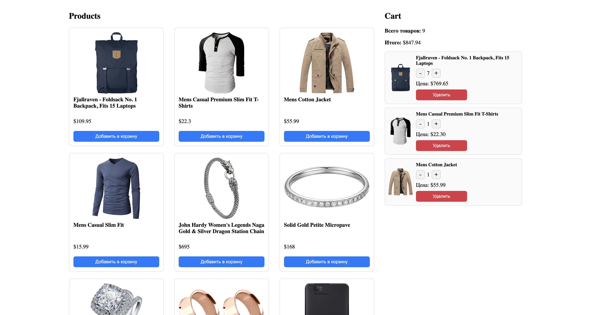

# Mini Marketplace 

## Имя
Бобур 

## Сколько времени заняло
Примерно **3 часа**

## Что было сложным
- Разделить проект на две независимые части:  
   - каталог на чистом JavaScript  
   - корзина на React  

## Скриншот интерфейса

## Ссылка на демо 
https://minii-marketplace.netlify.app/

